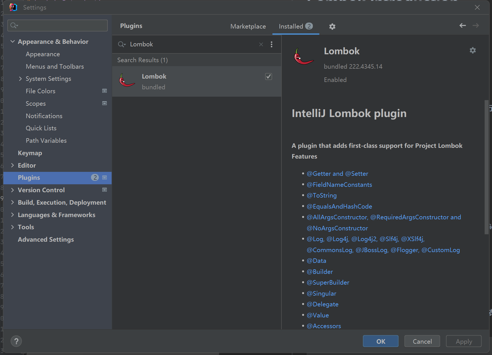

# Lombok Introduction

# 1. 引入

## 1.1 Lombok是什么？


Lombok是一个通过注解以达到减少代码效果的Java库，可以让项目代码更简洁。

## 1.2 Lombok 官网

[点击跳转 Lombok 官网](https://projectlombok.org/)

## 1.3 如何开始使用Lombok

方案一： IDE自带，Lombok与IntelliJ IDEA，Eclipse等ide兼容，可以在ide中进行设置使用，这里以IDEA为例：

- 打开 File > Settings > Plugins

- 搜索 Lombok

- 安装并重启 IDEA



方案二： 使用Maven的可以在pom.xml文件中添加以下依赖：
```
<dependencies>
	<dependency>
		<groupId>org.projectlombok</groupId>
		<artifactId>lombok</artifactId>
		<version>1.18.32</version>
		<scope>provided</scope>
	</dependency>
</dependencies>
```

# 2. 用法
具体用法的展示见test/java/LombokTest

---
**@Data**

注解在 **类** 上；提供类所有属性的 get 方法，所有非final属性的 set 方法，此外还提供了equals、canEqual、hashCode、toString 方法。

**@Setter**

注解在 **属性** 上；为单个属性提供 set 方法; 注解在 **类** 上，为该类所有的属性提供 set 方法， 都提供默认构造方法。

**@Getter**

注解在 **属性** 上；为单个属性提供 get 方法; 注解在 **类** 上，为该类所有的属性提供 get 方法，都提供默认构造方法。

**@ToString**

这个注解用在 **类** 上，可以生成所有参数的 toString 方法，还会生成默认的构造方法。

**@EqualsAndHashCode**

注解在 **类** 上, 可以生成 equals、canEqual、hashCode 方法。

**@NonNull**

注解在 **属性** 上，会自动产生一个关于此参数的非空检查，如果参数为空，则抛出一个空指针异常，也会有一个默认的无参构造方法。

**@NoArgsConstructor**

注解在 **类** 上；为类提供一个无参的构造方法。

**@AllArgsConstructor**

注解在 **类** 上；为类提供一个全参的构造方法，加了这个注解后，类中不提供默认构造方法了。

**@RequiredArgsConstructor**

这个注解用在 **类** 上，为类中所有带有 @NonNull 注解的或者带有 final 修饰的成员变量生成对应的构造方法。

拓展：[@AllArgsConstructor和@RequiredArgsConstructor在springboot代替@Autowired注入bean对象](https://blog.csdn.net/xueyijin/article/details/124618309?ops_request_misc=%257B%2522request%255Fid%2522%253A%2522171212943116800182138608%2522%252C%2522scm%2522%253A%252220140713.130102334.pc%255Fall.%2522%257D&request_id=171212943116800182138608&biz_id=0&utm_medium=distribute.pc_search_result.none-task-blog-2~all~first_rank_ecpm_v1~rank_v31_ecpm-8-124618309-null-null.142^v100^pc_search_result_base3&utm_term=%40RequiredArgsConstructor&spm=1018.2226.3001.4187)

**@Cleanup**

这个注解用在 **变量** 前面，可以保证此变量代表的资源会被自动关闭，默认是调用资源的 close() 方法，如果该资源有其它关闭方法，可使用 @Cleanup(“methodName”) 来指定要调用的方法，也会生成默认的构造方法

**@SneakyThrows**

这个注解用在 **方法** 上，可以将方法中的代码用 try-catch 语句包裹起来，捕获异常并在 catch 中用 Lombok.sneakyThrow(e) 把异常抛出，可以使用 @SneakyThrows(Exception.class) 的形式指定抛出哪种异常，也会生成默认的构造方法。

**@Log4j**

注解在 **类** 上；为类提供一个 属性名为 log 的 log4j 日志对象，提供默认构造方法。

**@Value**

这个注解用在 **类** 上，会生成含所有参数的构造方法，get 方法，此外还提供了equals、hashCode、toString 方法。

**@Synchronized**

这个注解用在 **类方法** 或者 **实例方法** 上，效果和 synchronized 关键字相同，区别在于锁对象不同，对于类方法和实例方法，synchronized 关键字的锁对象分别是类的 class 对象和 this 对象，而 @Synchronized 的锁对象分别是 私有静态 final 对象 lock 和 私有 final 对象 lock，当然，也可以自己指定锁对象，此外也提供默认的构造方法。

# 3. 参考
- [Lombok官网](https://projectlombok.org/)
- [Lombok使用详解](https://blog.csdn.net/u010695794/article/details/70441432?ops_request_misc=%257B%2522request%255Fid%2522%253A%2522171213099216800226538034%2522%252C%2522scm%2522%253A%252220140713.130102334..%2522%257D&request_id=171213099216800226538034&biz_id=0&utm_medium=distribute.pc_search_result.none-task-blog-2~all~top_positive~default-1-70441432-null-null.142^v100^pc_search_result_base3&utm_term=lombok&spm=1018.2226.3001.4187)
- [Lombok 看这篇就够了](https://zhuanlan.zhihu.com/p/32779910)